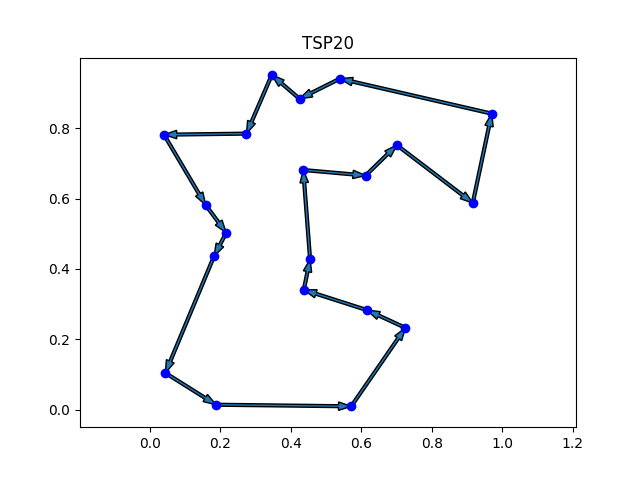
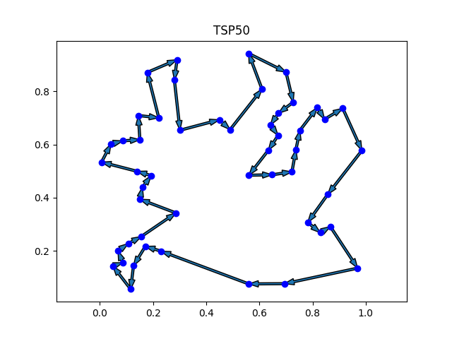
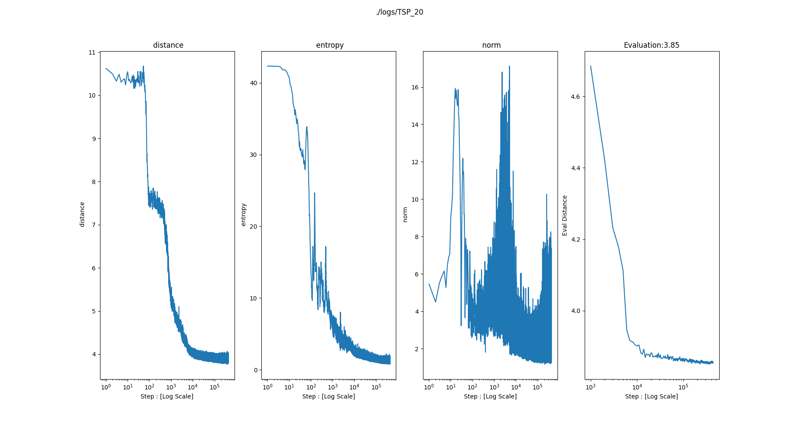
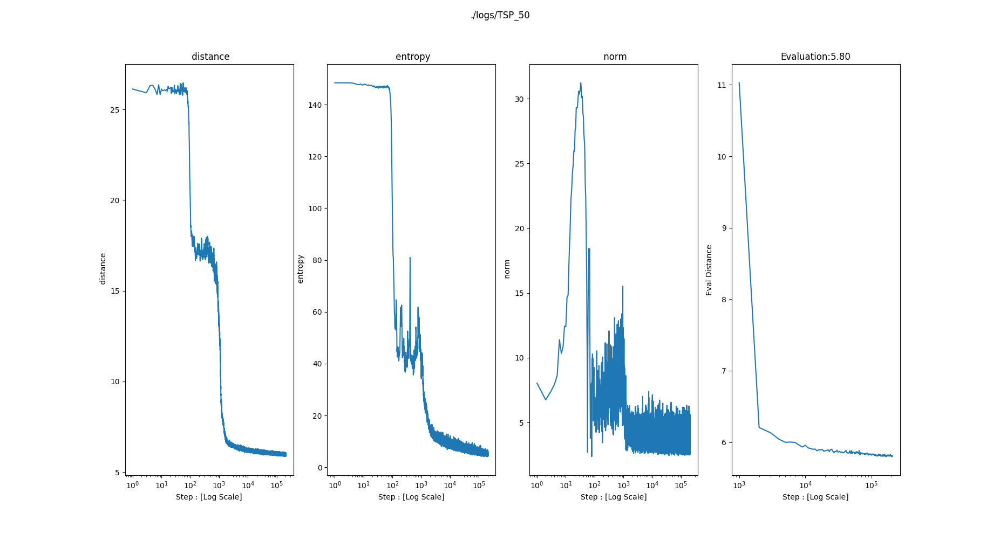

# Neural Combinatorial Optimization with Reinforcement Learning.

I implement "Neural Combinatorial Optimization with Reinforcement learning" with Pytorch. 

You can control whole algorithm simply using cfg.json file.

<!-- {: width="100", height="100"} -->
 

<h2> Install </h2>

Optional(Recommended) 

    conda create -n py36 python=3.6

    -----------------------------

    git clone https://github.com/seungju-mmc/baseline.git
    
    pip install -r requirements.txt

    
--------------------------------------------

<h2> Result </h2>

||TSP20|TSP50|
|------|---|---|
|Greedy|3.887|5.954|
|Sampling_001|3.909|6.014|
|Sampling_128|3.839|5.788|

------------------
<h2> Graph </h2>

